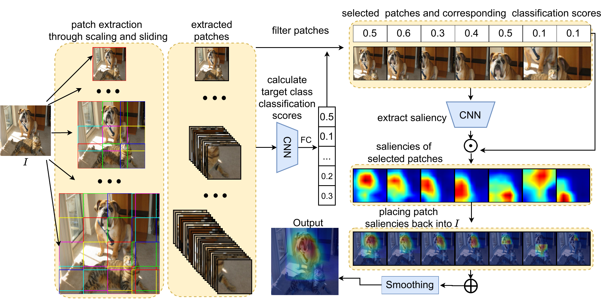

# SESS
 Saliency Enhancing with Scaling and Sliding
 
 # SESS: Saliency Enhancing with Scaling and Sliding [[arXiv]](https://arxiv.org/abs/2207.01769)
```BibTex
@inproceedings{
  tursun2022sess,
  title={{SESS}: Saliency Enhancing with Scaling and Sliding},
  author={Osman Tursun and Simon Denman and Sridha Sridharan and Clinton Fookes},
  booktitle={European Conference on Computer Vision (ECCV)},
  year={2022}
}
```

## Overview
SESS is a method and model agnostic extension to existing saliency map generation methods. With SESS, existing saliency approaches become robust to scale variance, multiple occurrences of target objects, presence of distractors and generate less noisy and more discriminative saliency maps. SESS improves saliency by fusing saliency maps extracted from multiple patches at different scales from different areas, and combines these individual maps using a novel fusion scheme that incorporates channel-wise weights and spatial weighted average. SESS is efficient, as it applies a pre-filtering step that can exclude uninformative saliency maps to improve efficiency while still enhancing overall results.

### SESS


### Qualitative comparison with related methods


# Requirements
PIL
cv2
matplotlib
numpy
torch
torchvision

# Other
- Note some parts of the codes are taken from [[group-CAM]](https://github.com/wofmanaf/Group-CAM)
- If you have any questions, feel free to open an issue